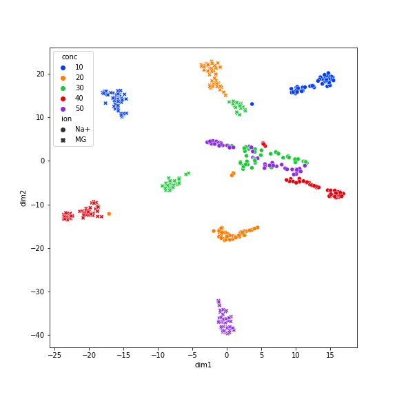

# This directory contains
 - `*.ipynb`: code used to process Molecular Dynamics simulation data and train VAE/CVAE to learn the distance array from MD data
 - `data/`: storing npz files of distance array of 100 atoms extracted from MD simulation
 - `results/`: storing result plots from VAE/CVAE training 

## Current progress
### VAE: latent space encoding clusters by variables of interest after learning

|                            Epoch 0                                |                                Epoch 19                             |
| ----------------------------------------------------------------- | ------------------------------------------------------------------- |
|   |   |

### CVAE: prediction of distance array for specific ion type and ions concentration
